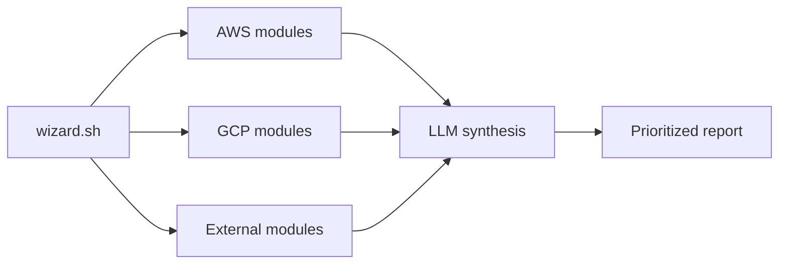

# StratusAI

Multi-cloud AI security scanner that produces AWS, GCP, and external exposure findings with attack-chain synthesis in about 2-4 minutes per scan.


## Demo

Add an 8-15 second GIF showing: wizard start -> cloud target selection -> findings -> AI attack-chain summary.

## What This Is For

A cloud-security engineer runs StratusAI to get quick exposure context across AWS, GCP, and external surfaces. It is designed for prioritized findings, not raw scanner noise.

## What It Produces

| Output | Use |
|---|---|
| Findings report | Cloud review |
| Attack-chain synthesis | Prioritization |
| JSON output | Automation |
| Deployment wizard | ECS Fargate or Cloud Run Job |
| Test suite | Regression confidence |

## Quick Start

```bash
git clone https://github.com/anpa1200/stratus-ai.git
cd stratus-ai
cp .env.example .env
./wizard.sh
python -m pytest
```

## How It Works



## Coverage

| Area | Coverage |
|---|---|
| AWS | 9 modules |
| GCP | 7 modules |
| External | 4 modules |
| AI providers | Claude, GPT-4o, Gemini |
| CI | 125-test suite; zero live cloud calls in CI |
| Cost | About $0.01-$0.15 per scan, depending on model |

## Limitations And Honesty

StratusAI is a fast prioritization layer. It should not replace CSPM, cloud logs, manual review, or organization-specific policy validation.

## Companion Article

https://medium.com/@1200km/stratusai-i-built-an-ai-powered-cloud-security-scanner-for-aws-and-gcp-heres-everything-89c6702d3b84

## Citation

See `CITATION.cff`.

## License

MIT recommended.

## Security Policy

See `SECURITY.md`.
